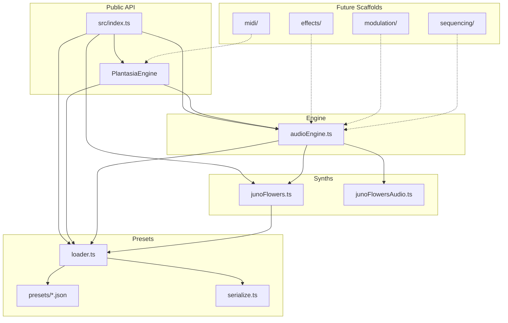

# Architecture

Plantasia Sound Engine is organized into layered subsystems. The **public API** (`src/index.ts`) re-exports only the stable v0.1.0 surface; internal modules are free to evolve behind that boundary.

## Subsystems

### Engine (`src/engine/`)

Core runtime: Tone.js graph wiring, botanical control mapping, preset playback, analyser/meter utilities, and the `PlantasiaEngine` facade.

- `audioEngine.ts` — functional API (`initAudio`, `playPreset`, …)
- `plantasiaEngine.ts` — class wrapper delegating to `audioEngine`

### Synth layer (`src/synths/`)

Species-specific synthesis paths that extend or bypass the default PolySynth graph.

- `junoFlowers.ts` — Juno Flowers preset constants (from JSON)
- `junoFlowersAudio.ts` — full Juno botanical graph, live voices, growth stages

### Effects (`src/effects/`)

**Scaffold only.** Defines `EffectId`, `EffectModule`, and `EffectRack` interfaces. The live engine currently uses inline Tone.js Reverb and Delay in `audioEngine.ts`. Future work moves these into a serial rack without changing the public API.

### Modulation (`src/modulation/`)

**Scaffold only.** Defines `ModulationMatrix` and route types. Basic LFO→filter modulation lives in `audioEngine.ts` today.

### Presets (`src/presets/` + `presets/`)

- Root `presets/` — human-editable JSON source of truth by category
- `scripts/sync-presets.mjs` — copies JSON into `src/presets/bundled/` before build
- `loader.ts` — assembles the `presets` array (order preserved from v0.1.0)
- `serialize.ts` — `serializePreset` / `deserializePreset` for JSON round-trips

### MIDI (`src/midi/`)

**Scaffold only.** Placeholder types for Web MIDI, MIDI Learn, velocity, aftertouch, and MPE. No runtime wiring yet.

### Sequencing (`src/sequencing/`)

**Scaffold only.** Placeholder types for Euclidean patterns, arpeggiator modes, probability gates, and scale quantization.

### Utils (`src/utils/`)

Shared types (`botanical`, `presets`, `junoFlowers`) and helpers (`ramp.ts`).

### Demo & examples

- `demo/` — primary smoke test importing built `dist/index.js`
- `examples/*` — focused demos per subsystem (basic, presets, effects, midi, sequencing, generative)

## Dependency diagram

Solid arrows = active dependencies. Dotted arrows = planned integration.

## External API

Consumers import from `plantasia-sound-engine` (or `dist/index.js`). Only exports in `src/index.ts` are semver-guaranteed.

Internal modules (`effects/`, `midi/`, etc.) may be exported via subpath exports in a future minor version once implemented.

## Build pipeline

1. `sync-presets` — copy `presets/` → `src/presets/bundled/`
2. `tsc` — compile `src/` → `dist/`
3. `postbuild` — copy bundled JSON → `dist/presets/bundled/`

This ensures Node and browser ESM can resolve JSON imports from emitted JavaScript.
