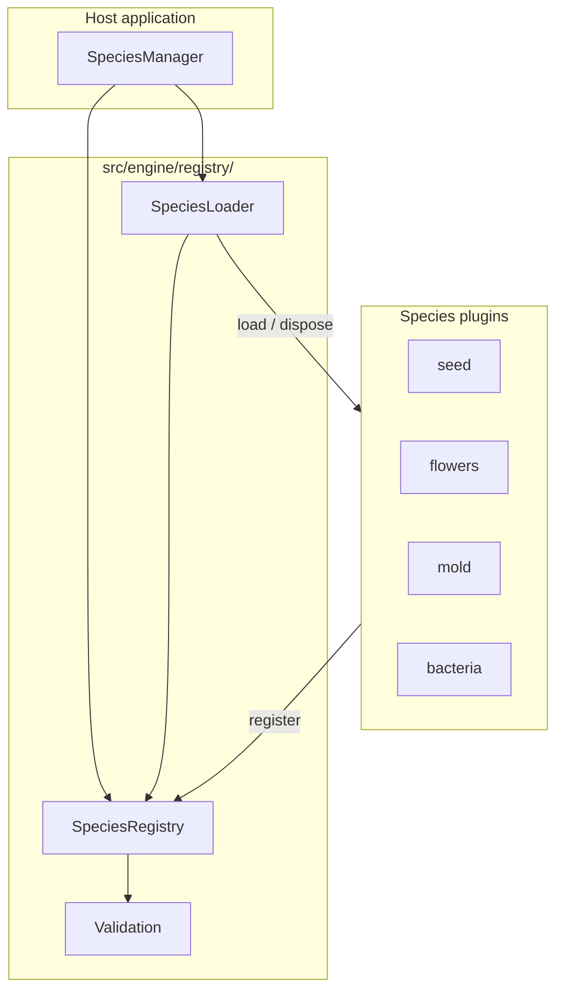

# Plugin Architecture

> **v2.0.0** — Species register as plugins; engine core has no hard-coded species. Validate: `npm run test:registry` or `npm run test`.

---

## Overview



The engine core (`SpeciesManager`, `EcologyControls`, generative/performance engines) never imports species implementation details directly. Built-in species register through a single bootstrap file.

---

## Registry (`SpeciesRegistry`)

Central discovery and registration:

| Responsibility | API |
|----------------|-----|
| Register a species | `register({ factory })` or `register(soundWorld)` |
| Prevent duplicate IDs | throws `DuplicateSpeciesError` |
| List species | `list()` (every registered species is playable) |
| Create instance | `create(id)` |

Registration validates:

- Metadata fields (id, name, concept, description, inspiration, character)
- ID format (`lowercase-with-hyphens`)
- Full `SoundWorld` interface for active species
- Ecological `setControl` smoke test for active species

---

## Loader (`SpeciesLoader`)

Lifecycle management:

1. Look up species in registry
2. Dispose previous species
4. Instantiate via factory
5. Validate compatibility
6. Call `initialize(context)`

Errors surface as `SpeciesLoadError` or `SpeciesValidationError` with an `issues` array.

---

## Validation (`Validation.ts`)

| Function | Purpose |
|----------|---------|
| `validateMetadata()` | Required fields, ID format, status |
| `validateSoundWorld()` | Interface methods present |
| `validateEcologicalControls()` | setControl smoke test |
| `assertValidSpecies()` | Throws `SpeciesValidationError` |

---

## Plugin lifecycle

```
register → list → load → initialize → start → (play) → stop → dispose
                      ↑                                    |
                      └──────── switch species ────────────┘
```

1. **Register** — at startup via `registerBuiltinSpecies(registry)` or custom plugins
2. **Discover** — `manager.getAvailableSpecies()`
3. **Load** — `manager.loadSpecies(id)`
4. **Play** — `noteOn`, `setControl`, generative `start()`
5. **Switch** — previous species disposed automatically
6. **Dispose** — `manager.dispose()` clears registry and active species

---

## Species status

There is none. A registered species is playable (ROADMAP decision 9, 2026-09-18). The earlier `coming_soon` and `disabled` placeholders, `registerPlaceholder()`, `listUpcoming()` and `SpeciesNotLoadableError` are gone; a species that is not ready is not registered.

---

## Adding a built-in species

1. Implement species in `src/species/<id>/`
2. Add one line to `src/species/registerBuiltinSpecies.ts`:

```typescript
registry.register({ factory: createYourSpeciesSoundWorld });
```

No changes to `SpeciesManager`, `createSpeciesManager.ts` core logic, or engine registry code.

---

## External plugins (future)

Third-party species can register on a `SpeciesRegistry` instance before passing it to `SpeciesManager`:

```typescript
import { SpeciesManager, SpeciesRegistry } from 'plantasia-sound-engine';

const registry = new SpeciesRegistry();
registerBuiltinSpecies(registry);
registry.register({ factory: createMyCustomWorld });

const manager = new SpeciesManager(registry);
await manager.loadSpecies('my-custom-world');
```

Dynamic `import()` loading from URLs is a future enhancement (Phase 16+).

---

## Species template

Copy `src/templates/species-template/` to bootstrap a new species. See [CREATING_A_SPECIES.md](./CREATING_A_SPECIES.md).

---

## Testing

```bash
npm run test:registry   # Registry, validation
npm run test:species    # Active species load + note smoke test
```

---

## Related

- [CREATING_A_SPECIES.md](./CREATING_A_SPECIES.md) — step-by-step contributor guide
- [SOUND_WORLD_ENGINE.md](./SOUND_WORLD_ENGINE.md) — Sound World architecture
- [API.md](./API.md) — public contract
